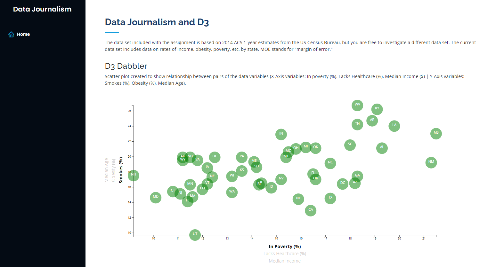
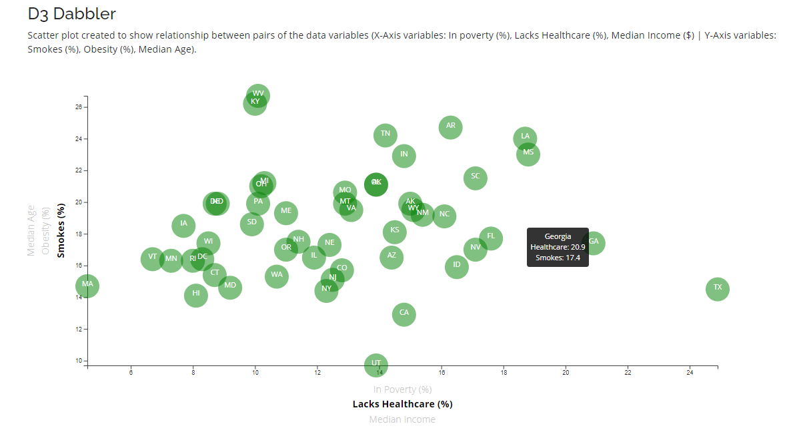

# D3 - Data Journalism and D3

## Background

Welcome to the newsroom! You've just accepted a data visualization position for a major metro paper. You're tasked with analyzing the current trends shaping people's lives, as well as creating charts, graphs, and interactive elements to help readers understand your findings.

The editor wants to run a series of feature stories about the health risks facing particular demographics. She's counting on you to sniff out the first story idea by sifting through information from the U.S. Census Bureau and the Behavioral Risk Factor Surveillance System.

The data set included with the assignment is based on 2014 ACS 1-year estimates from the [US Census Bureau](https://data.census.gov/cedsci/), but you are free to investigate a different data set. The current data set includes data on rates of income, obesity, poverty, etc. by state. MOE stands for "margin of error."

### Data Journalism and D3 Visualization
[https://melissamonroe.github.io/d3-data-journalism/](https://melissamonroe.github.io/d3-data-journalism/)

### Observations

- West Virginia and Kentucky have high smoking % and high % in poverty  

- Colorado lowest obesity. Hawaii and Washington DC lowest obesity and highest median income

- Mississipi, West Virginia, Arkansas highest obesity, lowest median income

- Maryland highest median income

- New Hamshire lowest % in poverty

- Texas highest % lacking healthcare

### D3 Dabbler

Scatter plot created to show relationship between two of the data variables such as `Poverty vs. Smokers`.

Using the D3 techniques, a scatter plot was created that represents each state with circle elements. This graphic was coded in the `app.js` file [app.js](/assets/js/app.js). Data was pulled in from the from `data.csv` [data.csv](/assets/data/data.csv) by using the `d3.csv` function. Your scatter plot should ultimately appear like the image at the top of this section.

* Included state abbreviations in the circles.

* Created and situated axes and labels to the left and bottom of the chart.

* Note: Used `python -m http.server` to run the visualization. This will host the page at `localhost:8000` in your web browser.

- - -

### Bonus: Dynamic D3 Dabbler

Why make a static graphic when D3 lets you interact with your data?

#### 1. More Data, More Dynamics

You're going to include more demographics and more risk factors. Place additional labels in your scatter plot and give them click events so that your users can decide which data to display. Animate the transitions for your circles' locations as well as the range of your axes. Do this for two risk factors for each axis. Or, for an extreme challenge, create three for each axis.

* Hint: Try binding all of the CSV data to your circles. This will let you easily determine their x or y values when you click the labels.

#### 2. Incorporate d3-tip

D3 graphics used to reveal a specific element's data when the user hovers their cursor over the element. Tooltips were added to circles. Each tooltip displays the data that the user has selected. Use thed `d3-tip.js` plugin developed by [Justin Palmer](https://github.com/Caged)

* Check out [David Gotz's example](https://bl.ocks.org/davegotz/bd54b56723c154d25eedde6504d30ad7) to see how you should implement tooltips with d3-tip.

